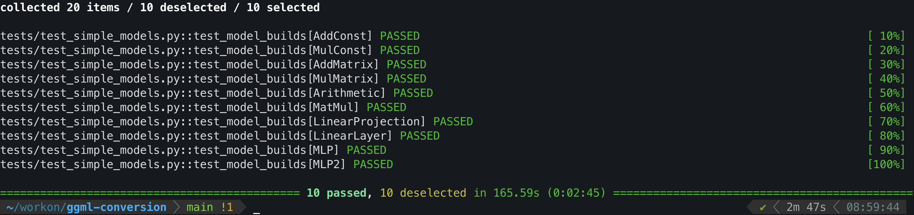

# ggml-conversion



## Description

This repository contains the code for the conversion of PyTorch models to GGML format. The conversion is done using the
[ONNX](https://onnx.ai/) format as an intermediate representation. This can be used to convert models from other
frameworks to GGML as well, as long as they support ONNX.

## Installation

The conversion code is written in Python 3.11. To install the required dependencies, run:

```bash
poetry install
```

If you do not have Poetry installed, please refer to the [Poetry documentation](https://python-poetry.org/docs/).

## Testing

To run the tests, run:

```bash
make clean test
```
